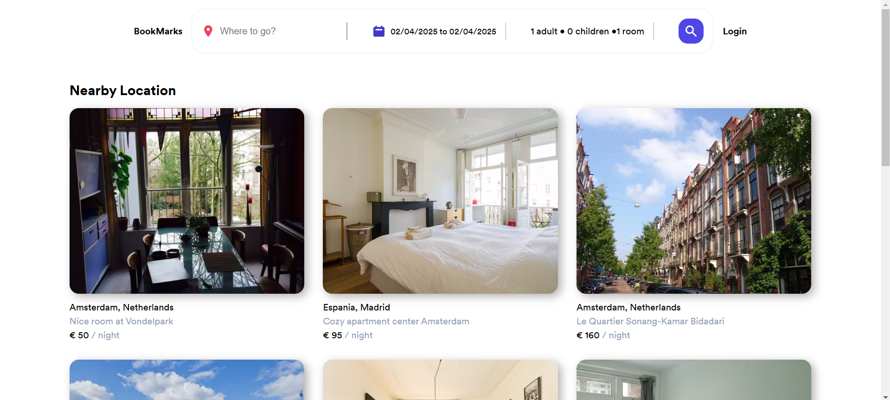
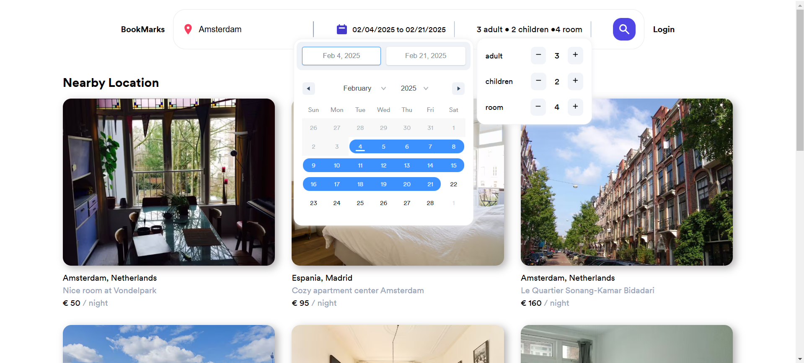
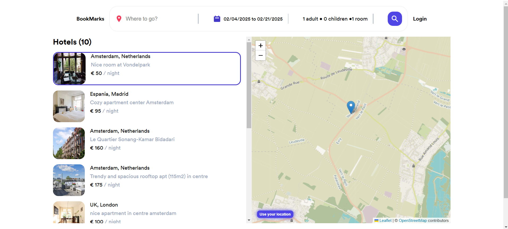
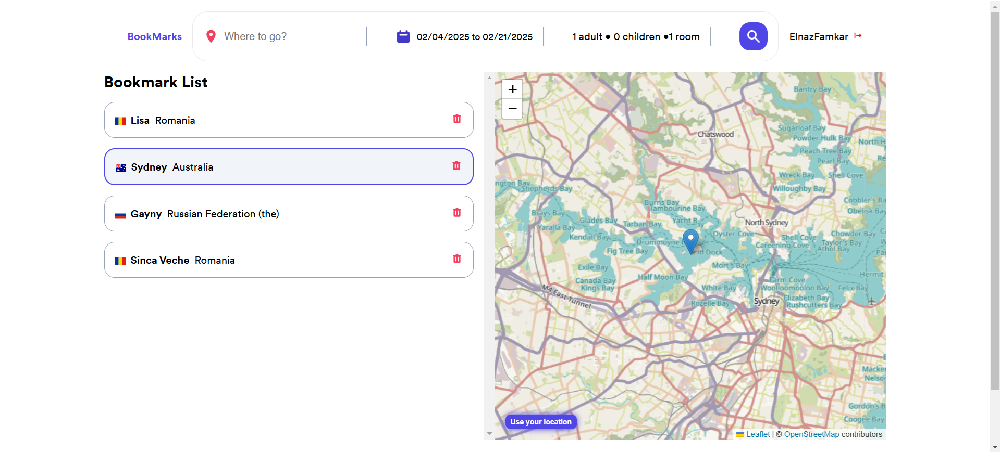
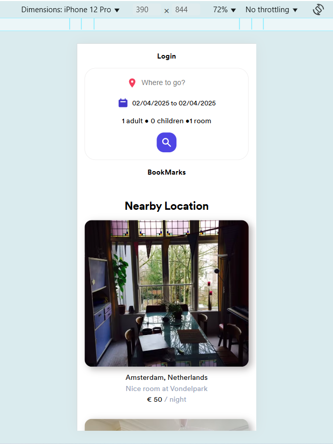

# Booking App by Elle Famkar (React-based)

## Welcome to the Booking App! 👋😍

ℹ️ Remember to install node package and then command -> npm run dev so as to start the project

## Table of contents

- [Overview](#overview)
  - [The challenge](#the-challenge)
  - [Screenshot](#screenshot)
  - [Links](#links)
- [My process](#my-process)
  - [Built with](#built-with)
  - [What I learned](#what-i-learned)
  - [Continued development](#continued-development)
  - [Useful resources](#useful-resources)
- [Author](#author)
- [Acknowledgments](#acknowledgments)

## Overview

Thank you for exploring this React project! The goal was to gain experience with React, custom hooks, context, Protected Route, and real data integration. I hope you enjoy it and welcome your feedback!

Remember that "Every day is a learning day", so let's checkout the requirements to start such project

### The challenge

In his project you should be familiar to:

- A good react mindset
- Good state management
- Component composition
- Custom hooks
- Map in React
- Data integration

### Screenshot








<!-- ### Links

- Live Site URL: [Booking App](https://the-rick-and-morty-elle.netlify.app/) -->

## My process

### Where to find resources

This repository provides even the smallest details about the requirements of this project such as `styles`, `logics` and `structures` as well as finding all the required details on the logic including custom hooks and context.

### Built with

- react
- react hooks
- custom hooks
- react icons
- react hot toast
- react country flag
- react date range
- react-leaflet
- react-router-dom
- axios
- CSS
- Semantic HTML5 markup
- desktop-first workflow

You can use any tools you like to help you complete the project. So if you got something you'd like to practice, feel free to give it a try.

### What I learned

This projects helped me being more confident with the details of react components, hooks and their importance, data integration and react mindset to create a responsive and dynamic web app.

To see parts of my codes and see how you can add code snippets, see below:

```Jsx

function Map({ markerLocations }) {
  const [mapCenter, setMapCenter] = useState([52, 4]);
  const [lat, lng] = useUrlParams();

  const {
    isLoading: isLoadingPosition,
    position: geoLocationPosition,
    getPosition,
  } = useGeoLocation();

  useEffect(() => {
    if (lat && lng) {
      setMapCenter([lat, lng]);
    }
  }, [lat, lng]);

  useEffect(() => {
    if (geoLocationPosition?.lat && geoLocationPosition?.lng)
      setMapCenter([geoLocationPosition.lat, geoLocationPosition.lng]);
  }, [geoLocationPosition]);

  return (
    <div className="mapContainer">
      <MapContainer
        className="map"
        center={mapCenter}
        zoom={9}
        scrollWheelZoom={true}
      >
        <button onClick={getPosition} className="getLocation">
          {isLoadingPosition ? "Loading..." : "Use your location"}
        </button>
        <TileLayer
          attribution='&copy; <a href="https://www.openstreetmap.org/copyright">OpenStreetMap</a> contributors'
          url="https://{s}.tile.openstreetmap.fr/hot/{z}/{x}/{y}.png"
        />
        <DetectClick />
        <ChangeCenter position={mapCenter} />
        {markerLocations.map((item) => (
          <Marker key={item.id} position={[item.latitude, item.longitude]}>
            <Popup>{item.host_location}</Popup>
          </Marker>
        ))}
      </MapContainer>
    </div>
  );
}

export default Map;

function ChangeCenter({ position }) {
  const map = useMap();
  map.setView(position);
  return null;
}


function DetectClick() {
  const navigate = useNavigate();
  useMapEvent({
    click: (e) =>
      navigate(`/bookmark/add?lat=${e.latlng.lat}&lng=${e.latlng.lng}`),
  });
  return null;
}


const BookmarkContext = createContext();

const BASE_URL = "http://localhost:5000";

const initialState = {
  bookmarks: [],
  isLoading: false,
  currentBookmark: null,
  error: null,
};

const bookmarkReducer = (state, action) => {
  switch (action.type) {
    case "loading":
      return {
        ...state,
        isLoading: true,
      };
    case "bookmarks/loaded":
      return {
        ...state,
        isLoading: false,
        bookmarks: action.payload,
      };
    case "bookmark/loaded":
      return {
        ...state,
        isLoading: false,
        currentBookmark: action.payload,
      };
    case "bookmark/created":
      return {
        ...state,
        isLoading: false,
        bookmarks: [...state.bookmarks, action.payload],
        currentBookmark: action.payload,
      };
    case "bookmark/deleted":
      return {
        ...state,
        isLoading: false,
        bookmarks: state.bookmarks.filter((item) => item.id !== action.payload),
        currentBookmark: null,
      };
    case "rejected":
      return {
        ...state,
        isLoading: false,
        error: action.payload,
      };
    default:
      throw new Error("Unknown action!");
  }
};

function BookmarkProvider({ children }) {

  const [{ bookmarks, isLoading, currentBookmark }, dispatch] = useReducer(
    bookmarkReducer,
    initialState
  );

  useEffect(() => {
    async function fetchBookmarkList() {
      dispatch({ type: "loading" });
      try {
        const { data } = await axios.get(`${BASE_URL}/bookmarks`);
        dispatch({ type: "bookmarks/loaded", payload: data });
      } catch (error) {
        toast.error(error.message);
        dispatch({
          type: "rejected",
          payload: "An error occured in loading bookmarks!",
        });
      }
    }

    fetchBookmarkList();
  }, []);

  async function getBookmark(id) {
    if (Number(id) === currentBookmark?.id) return;

    dispatch({ type: "loading" });
    try {
      const { data } = await axios.get(`${BASE_URL}/bookmarks/${id}`);
      dispatch({ type: "bookmark/loaded", payload: data });
    } catch (error) {
      toast.error(error.message);
      dispatch({
        type: "rejected",
        payload: "An error occured in getting bookmark!",
      });
    }
  }

  async function createBookmark(newBookmark) {
    dispatch({ type: "loading" });

    try {
      const { data } = await axios.post(`${BASE_URL}/bookmarks/`, newBookmark);
      dispatch({ type: "bookmark/created", payload: data });
    } catch (error) {
      toast.error(error.message);
      dispatch({
        type: "rejected",
        payload: "An error occured in creating bookmark!",
      });
    }
  }

  async function deleteBookmark(id) {
    dispatch({ type: "loading" });

    try {
      await axios.delete(`${BASE_URL}/bookmarks/${id}`);
      // setBookmarks((prev) => prev.filter((item) => item.id !== id));
      dispatch({ type: "bookmark/deleted", payload: id });
    } catch (error) {
      toast.error(error.message);
      dispatch({
        type: "rejected",
        payload: error.message,
      });
    }
  }

  return (
    <BookmarkContext.Provider
      value={{
        isLoading,
        bookmarks,
        getBookmark,
        currentBookmark,
        createBookmark,
        deleteBookmark,
      }}
    >
      {children}
    </BookmarkContext.Provider>
  );
}

export default BookmarkProvider;

export function useBookmark() {
  return useContext(BookmarkContext);
}

```

### Continued development

In my future projects, not only i am going to focus on improving my knowledge of react and typeScript so as to develop more useful and great projects.

### Useful resources

In order to do this project in a correct way you need to have a good knowledge of html and pure css and grid and then tailwind and you need to know how to work with alpine js in the project and connect it to css if you want to use js.

- [w3schools](https://www.w3schools.com/)
- [MDN](https://developer.mozilla.org/en-US/) - Remember that no matter how many tutorial videos you have watched, you always need to learn details and features from codes documentations
- [codeacademy](https://www.codecademy.com/)
- [udemy](https://www.udemy.com/) - Here you can find a number of tutorials in different languages
- [coursera](https://www.coursera.org/)


## Author

- Website : [Elle Famkar](https://ellefamkar.com/)
- GitHib : [Elle Famkar](https://github.com/ellefamkar)
- Twitter : [@Ellefamkar](https://www.twitter.com/ellefamkar)

Feel free to ask any questions come to your mind on my github account!

## Acknowledgments

I want to thanks everyone who has been inspiring and helpfull with great projects, tips and lessons.

**Have fun using this project!** 🚀
